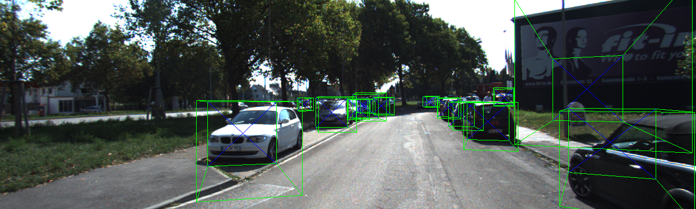
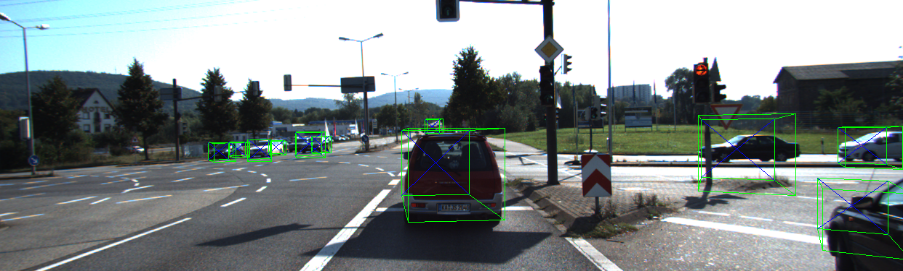
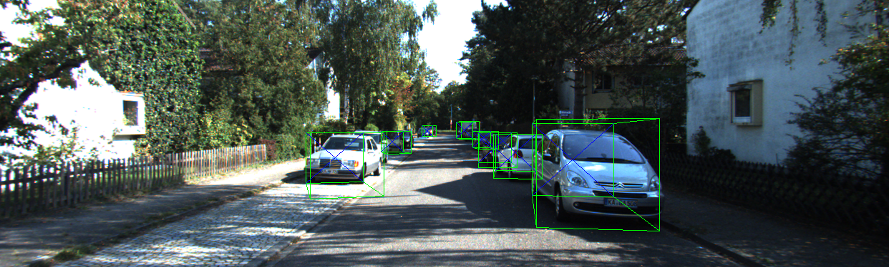

# YOLO For 3D Object Detection

## Inference
```
python inference.py \
    --weights yolov5s.pt \
    --source eval/image_2 \
    --reg_weights weights/resnet_10.pkl \
    --model_list resnet \
    --output_path runs/detect/ \
    --show_result -- save_result
```

## Training
```
python train.py \
    --epochs 10 \
    --batch_size 32 \
    --num_workers 2 \
    --save_epoch 5 \
    --train_path ./dataset/KITTI/training \
    --model_path ./weights \
    --select_model resnet18
```
```
!python train_lightning.py \
    --train_path dataset/KITTI/training \
    --checkpoint_path weights/checkpoints \
    --model_select resnet18 \
    --epochs 10 \
    --batch_size 32 \
    --num_workers 2 \
    --gpu 1 \
    --val_split 0.1 \
    --model_path weights
```






## Reference
- [YOLOv5 by Ultralytics](https://github.com/ultralytics/yolov5)
- [shakdem/3D-BoungingBox](https://github.com/skhadem/3D-BoundingBox)

```
@misc{mousavian20173d,
      title={3D Bounding Box Estimation Using Deep Learning and Geometry}, 
      author={Arsalan Mousavian and Dragomir Anguelov and John Flynn and Jana Kosecka},
      year={2017},
      eprint={1612.00496},
      archivePrefix={arXiv},
      primaryClass={cs.CV}
}
```